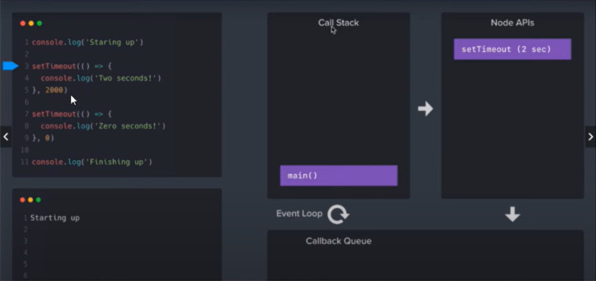

### [Event Loop](https://www.youtube.com/watch?v=mGVFltBxLKU)

The event loop is what allows Node.js to perform non-blocking I/O operations — despite the fact that JavaScript is single-threaded — by offloading operations to the system kernel whenever possible.

**Main components in architecture** :

- **<u>Call Stack</u>** : Place where all the functions are registered executed.
- **<u>Node API</u>** : Place where all asynchronous code is added.
  For Example : **setTimeout()** will not get processed in the callback stack. It is added from the callback stack to the Node APIs where an event is registered and a callback function is set to get processed in the background.As it is added to Node API other executions can occur.This is called **non-blocking** behavior where all the synchronous functions are processed and executed first and asynchronous functions are processed in the background while waiting their turn to get executed.
- **<u>Event/Callback Queue</u>** : In the background, all the asynchronous functions get processed and their callbacks are stored in the **callback queue**. The one which is processed first will be added first in the queue for execution in the callback stack.Now, one by one they are pushed to the callback stack using the event loop and finally get executed.

### Events and Event Emitter

The **events** module offers the EventEmitter class, which we can use to handle our events.

This object exposes methods like:

- **emit()** is used to trigger an event
- **on()** is used to add a callback function that's going to be executed when the event is triggered
- **once()** add a one-time listener
- **removeListener() / off()** remove an event listener from an event
- **removeAllListeners()** remove all listeners for an event

### REPL : Read-Evaluate-Print-Loop

It is a programming language environment (basically a console window) that takes single expression as user input and returns the result back to the console after execution. The REPL session provides a convenient way to quickly test simple JavaScript code.
