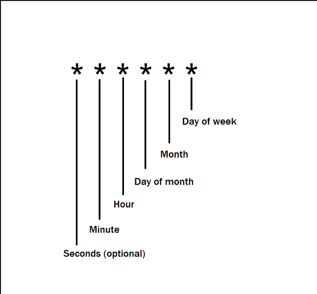

**Node-cron** is a handy npm package which you can use to schedule jobs to run at specific times or intervals. It is most suitable for scheduling repetitive jobs such as email notifications, file downloads, and database backups.

Syntax:

```javascript
cron.schedule("* * * * * *", function () {
  // Task to do
});
```

Time formatting for Cron jobs:



Descriptors with their ranges:

- Seconds (optional): 0 – 59
- Minute: 0 – 59
- Hour: 0 – 23
- Day of the Month: 1 – 31
- Month: 1 – 12
- Day of the week: 0 – 7 (0 and 7 both represent Sunday)
