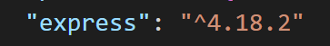

### Routing

Routing refers to determining how an application responds to a client request to a particular endpoint, which is a URI (or path) and a specific HTTP request method (GET, POST, and so on).

Route take the following definition:

**app.METHOD(PATH, HANDLER)**

- app is an instance of express.
- METHOD is an HTTP request method, in lowercase.
- PATH is a path on the server.
- HANDLER is the function executed when the route is matched.

### Versioning

- ^ : indicates that 4 is locked and any updates will be within 4.... (i.e. first digit is fixed.)
- 1st Part (4) : Major Release
- 2nd Part (18) : Latest (Recommended bug Fix)
- 3rd Part (2) : Minor Fixes
- if it is ~4.18.3 : then 4.18 is fixed and only last digit will change when updated.
