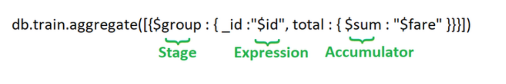

### Stages: Each stage starts from stage operators which are:

    - $match: It is used for filtering the documents can reduce the amount of documents that are given as input to the next stage.
    - $project: It is used to select some specific fields from a collection.
    - $group: It is used to group documents based on some value.
    - $sort: It is used to sort the document that is rearranging them
    - $skip: It is used to skip n number of documents and passes the remaining documents
    - $limit: It is used to  pass first n number of documents thus limiting them.
    - $unwind: It is used to unwind documents that are using arrays i.e. it deconstructs an array field in the documents to return documents for each element.
    - $out: It is used to write resulting documents to a new collection

### Expressions: It refers to the name of the field in input documents

for e.g. { $group : { _id : "$id", total:{$sum:"$fare"}}} here $id and $fare are expressions.

### Accumulators: These are basically used in the group stage

    - max: It gets the maximum value from all the documents.
    - min: It gets the minimum value from all the documents.
    - sum: It sums numeric values for the documents in each group.
    - avg: It calculates the average of all given values from all documents.
    - count: It counts total numbers of documents.
    - first: It gets the first document from the grouping.
    - last: It gets the last document from the grouping.
