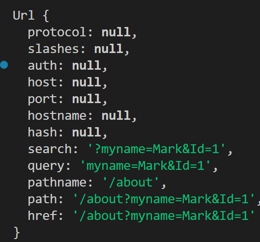

url : https://www.youtube.com/results?search_query=javascript

- https : protocol
- www.youtube.com : domain name
- /results : path ( can be nested i.e. /results/next)
- everything after ? : query (i.e. search_query is keyword)

**This is printed on console when I pass an arbitrary search query.**

